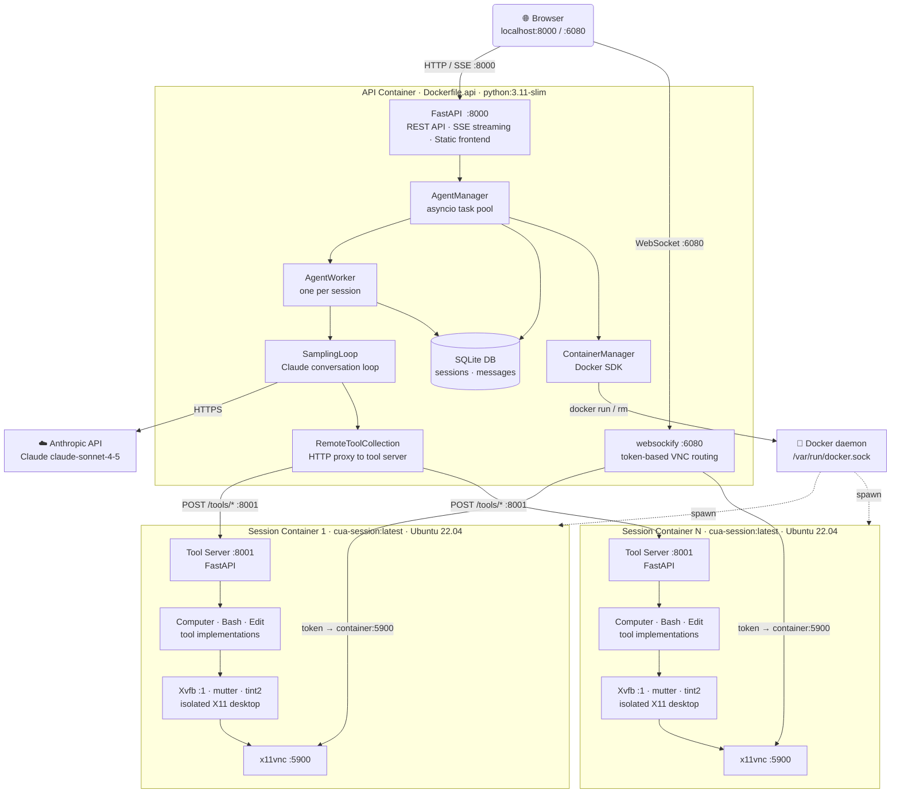

### Author: Nadir Zane

# Computer Using Agent

A Docker-based computer-use agent powered by Anthropic's Claude. Each session dynamically spawns an **isolated Docker container** with a full X11 desktop environment. Sessions run fully concurrently with no fixed display limits, no queuing, and complete filesystem isolation between users.

## Demo Video

https://drive.google.com/file/d/1C0Nd9AClhU5rwYMWFfQEYDC32dfiz_sG/view?usp=sharing

## Architecture

The system is split into two Docker images:

- **API container** (`Dockerfile.api`) — FastAPI app, Claude integration, session management, noVNC/websockify proxy. Runs as a single long-lived service.
- **Session containers** (`session_container/Dockerfile`) — One spawned per session on demand. Each runs a full X11 desktop (Xvfb + mutter + tint2 + x11vnc) and a lightweight tool server (FastAPI on `:8001`) that exposes Computer, Bash, and Edit tools over HTTP.

When a task is submitted, **AgentManager** creates an **AgentWorker** (asyncio task) and calls **ContainerManager** to spawn a session container via the Docker SDK. The sampling loop calls tools by posting to the session container's tool server (`http://<container-name>:8001`). Screenshots, mouse/keyboard actions, and bash commands all execute inside the isolated container. The browser connects to the desktop via **websockify** on port `6080`, which routes WebSocket connections to the correct container using a `?token=<session_id>` lookup.

### Architecture Diagram



### Request Flow

```
User submits task
  → POST /api/v1/agent/{id}/task          (FastAPI)
  → AgentManager.submitTask()
      → ContainerManager.createSession()  (Docker SDK — spawns cua-session container)
      → AgentWorker.run()                 (asyncio task)
          → samplingLoop()
              → Anthropic API             (Claude generates tool calls)
              → RemoteToolCollection.run()
                  → POST http://<container>:8001/tools/computer|bash|edit
                      → tool executes on isolated X11 desktop
                      → screenshot / output returned
              ← tool result fed back to Claude
          ← final response streamed via SSE to browser
  → GET /api/v1/agent/{id}/stream         (SSE — browser receives live events)
  → websockify :6080 ?token={id}          (browser views live desktop via noVNC)
```

## Quick Start

**Prerequisites:** [Docker](https://docs.docker.com/get-docker/), Docker Compose, and an [Anthropic API key](https://console.anthropic.com/).

```bash
git clone https://github.com/muhammad65muneeb-create/COMPUTER-USING-AGENT.git
cd computer-using-agent

# Build both images
docker build -f session_container/Dockerfile -t cua-session:latest .
docker compose up --build
```

Open [localhost:8000](http://localhost:8000). API docs at [localhost:8000/docs](http://localhost:8000/docs).

> **Note:** The session image (`cua-session:latest`) must be built before starting the API container. The API container spawns session containers dynamically — it does not build them itself.

## Project Structure

```
Dockerfile.api              Main app image (python:3.11-slim, no X11)
session_container/
  Dockerfile                Session VM image (Ubuntu 22.04, full X11 stack)
  entrypoint.sh             Startup: Xvfb → mutter → tint2 → x11vnc → tool server
  tool_server.py            FastAPI tool server (Computer, Bash, Edit over HTTP :8001)
  tools/                    Tool implementations (computer.py, bash.py, edit.py)

backend/
  api/                      REST endpoints (sessions, agent, files, health)
  db/                       SQLAlchemy models, schemas, async SQLite engine
  services/
    agent_manager.py        Asyncio task pool, SSE event queues
    agent_worker.py         Per-session Claude loop executor + streaming callbacks
    container_manager.py    Docker SDK — spawn/destroy session containers
    sampling_loop.py        Anthropic API conversation loop + system prompt
  tools/
    remote_collection.py    HTTP proxy → session container tool server
    schemas.py              Anthropic tool parameter schemas

frontend/                   Vanilla JS browser UI (ES modules)
  modules/                  state, sessions, chat/SSE, VNC, files, dialogs, audio

image/
  entrypoint.sh             API container startup (uvicorn + websockify)
  novnc_startup.sh          Launches websockify with token file routing
```

## Environment Variables

| Variable             | Default                                              | Description                              |
|----------------------|------------------------------------------------------|------------------------------------------|
| `ANTHROPIC_API_KEY`  | —                                                    | **Required.** Claude API key             |
| `SESSION_IMAGE`      | `cua-session:latest`                                 | Docker image used for session containers |
| `SESSION_NETWORK`    | `cua-network`                                        | Docker network shared by all containers  |
| `DATABASE_URL`       | `sqlite+aiosqlite:////opt/.cua/sessiondb/sessions.db`| SQLAlchemy database URL                  |
| `WIDTH`              | `1024`                                               | Desktop width (px) for session containers|
| `HEIGHT`             | `768`                                                | Desktop height (px) for session containers|

## Ports

| Port | Service                                          |
|------|--------------------------------------------------|
| 8000 | FastAPI — REST API, SSE streams, frontend static |
| 6080 | websockify — token-based noVNC routing           |

Session containers expose ports **5900** (x11vnc) and **8001** (tool server) internally on `cua-network` only — they are not mapped to the host.

## How Sessions Are Isolated

Each session gets:
- A dedicated Docker container running Ubuntu 22.04
- Its own `DISPLAY=:1` (no conflicts — isolated at the container level)
- A fresh Linux user (`agent_<session_id[:8]>`) with a private home directory
- An independent tool server process with its own bash session
- A VNC token entry in `/tmp/vnc_tokens.cfg` that websockify uses to route the browser connection
